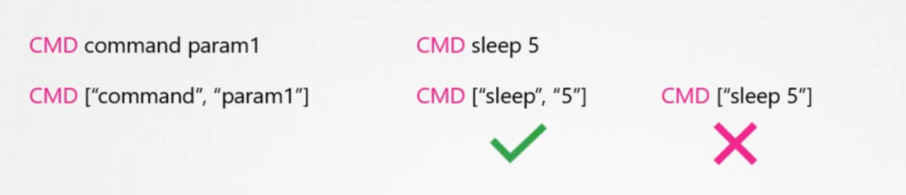

# Rolling Update

```
kubectl rollout status deployment deployment_name

kubectl rollout history deployment deployment_name

kubectl rollout undo deployment deployment_name
```

### we have to update strategy: 
* Recreate
* Rolling-Update
# ------------------------------------------------


# command and args


* command ------->  ENTRYPOINT
* args    ------->  CMD

```
apiVersion: v1
kind: Pod
metadata:
  name: command-demo
  labels:
    purpose: demonstrate-command
spec:
  containers:
  - name: command-demo-container
    image: debian
    command: ["printenv"]
    args: ["HOSTNAME", "KUBERNETES_PORT"]
  restartPolicy: OnFailure

```

```
env:
- name: MESSAGE
  value: "hello world"
command: ["/bin/echo"]
args: ["$(MESSAGE)"]
```

```
env:
- name: MESSAGE
  value: "hello world"
command: 
  - "sleep"
  - "1200"
```

# Environment Variables
## topical env
```
apiVersion: v1
kind: Pod
metadata:
  name: envar-demo
  labels:
    purpose: demonstrate-envars
spec:
  containers:
  - name: envar-demo-container
    image: gcr.io/google-samples/node-hello:1.0
    env:
    - name: DEMO_GREETING
      value: "Hello from the environment"
    - name: DEMO_FAREWELL
      value: "Such a sweet sorrow"

```


```
apiVersion: v1
kind: Pod
metadata:
  name: dependent-envars-demo
spec:
  containers:
    - name: dependent-envars-demo
      args:
        - while true; do echo -en '\n'; printf UNCHANGED_REFERENCE=$UNCHANGED_REFERENCE'\n'; printf SERVICE_ADDRESS=$SERVICE_ADDRESS'\n';printf ESCAPED_REFERENCE=$ESCAPED_REFERENCE'\n'; sleep 30; done;
      command:
        - sh
        - -c
      image: busybox:1.28
      env:
        - name: SERVICE_PORT
          value: "80"
        - name: SERVICE_IP
          value: "172.17.0.1"
        - name: UNCHANGED_REFERENCE
          value: "$(PROTOCOL)://$(SERVICE_IP):$(SERVICE_PORT)"
        - name: PROTOCOL
          value: "https"
        - name: SERVICE_ADDRESS
          value: "$(PROTOCOL)://$(SERVICE_IP):$(SERVICE_PORT)"
        - name: ESCAPED_REFERENCE
          value: "$$(PROTOCOL)://$(SERVICE_IP):$(SERVICE_PORT)"


```

## valueFrom:
### fieldRef
```
apiVersion: v1
kind: Pod
metadata:
  name: dapi-envars-fieldref
spec:
  containers:
    - name: test-container
      image: registry.k8s.io/busybox
      command: [ "sh", "-c"]
      args:
      - while true; do
          echo -en '\n';
          printenv MY_NODE_NAME MY_POD_NAME MY_POD_NAMESPACE;
          printenv MY_POD_IP MY_POD_SERVICE_ACCOUNT;
          sleep 10;
        done;
      env:
        - name: MY_NODE_NAME
          valueFrom:
            fieldRef:
              fieldPath: spec.nodeName
        - name: MY_POD_NAME
          valueFrom:
            fieldRef:
              fieldPath: metadata.name
        - name: MY_POD_NAMESPACE
          valueFrom:
            fieldRef:
              fieldPath: metadata.namespace
        - name: MY_POD_IP
          valueFrom:
            fieldRef:
              fieldPath: status.podIP
        - name: MY_POD_SERVICE_ACCOUNT
          valueFrom:
            fieldRef:
              fieldPath: spec.serviceAccountName
  restartPolicy: Never
```

### resourceFieldRef
```
apiVersion: v1
kind: Pod
metadata:
  name: dapi-envars-resourcefieldref
spec:
  containers:
    - name: test-container
      image: registry.k8s.io/busybox:1.24
      command: [ "sh", "-c"]
      args:
      - while true; do
          echo -en '\n';
          printenv MY_CPU_REQUEST MY_CPU_LIMIT;
          printenv MY_MEM_REQUEST MY_MEM_LIMIT;
          sleep 10;
        done;
      resources:
        requests:
          memory: "32Mi"
          cpu: "125m"
        limits:
          memory: "64Mi"
          cpu: "250m"
      env:
        - name: MY_CPU_REQUEST
          valueFrom:
            resourceFieldRef:
              containerName: test-container
              resource: requests.cpu
        - name: MY_CPU_LIMIT
          valueFrom:
            resourceFieldRef:
              containerName: test-container
              resource: limits.cpu
        - name: MY_MEM_REQUEST
          valueFrom:
            resourceFieldRef:
              containerName: test-container
              resource: requests.memory
        - name: MY_MEM_LIMIT
          valueFrom:
            resourceFieldRef:
              containerName: test-container
              resource: limits.memory
  restartPolicy: Never

```
### secretKeyRef

```

apiVersion: v1
kind: Secret
metadata:
  name: test-secret
data:
  username: bXktYXBw
  password: Mzk1MjgkdmRnN0pi


---
apiVersion: v1  
kind: Pod
metadata: 
  name: env-single-secret  
spec: 
  containers:
  - name: envars-test-container 
    image: nginx 
    env:  
    - name: SECRET_USERNAME
      valueFrom: 
        secretKeyRef:
          name: backend-user 
          key: backend-username
   
```


```
kubectl create secret generic backend-user --from-literal=backend-username='backend-admin'
kubectl create secret generic db-user --from-literal=db-username='db-admin'


---

apiVersion: v1
kind: Pod  
metadata: 
  name: envvars-multiple-secrets 
spec:
  containers:  
  - name: envars-test-container  
    image: nginx  
    env:
    - name: BACKEND_USERNAME
      valueFrom: 
        secretKeyRef:
          name: backend-user
          key: backend-username
    - name: DB_USERNAME
      valueFrom: 
        secretKeyRef: 
          name: db-user
          key: db-username

```
## Configure all key-value pairs in a Secret as container environment variables
```
kubectl create secret generic test-secret --from-literal=username='my-app' --from-literal=password='39528$vdg7Jb'


---
apiVersion: v1 
kind: Pod
metadata: 
  name: envfrom-secret  
spec: 
  containers:
  - name: envars-test-container
    image: nginx 
    envFrom:
    - secretRef:
        name: test-secret


```