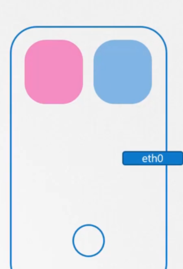
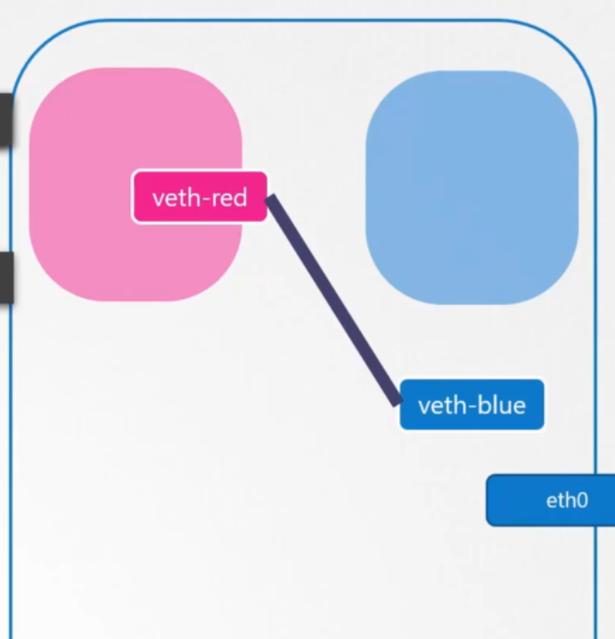
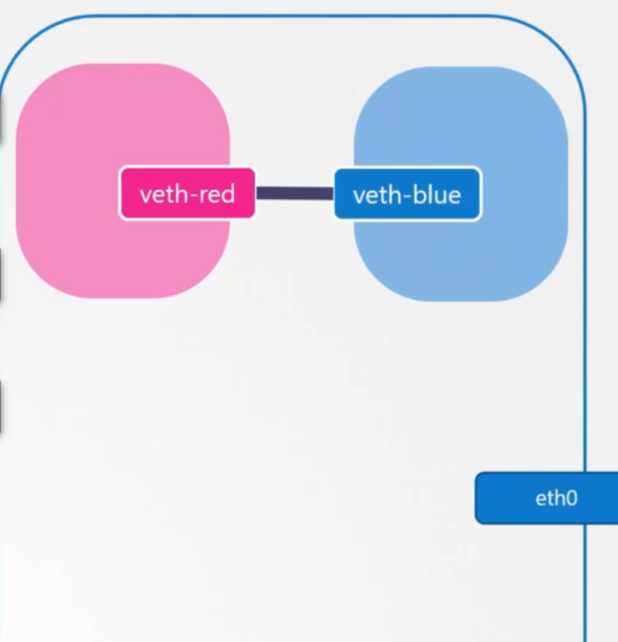
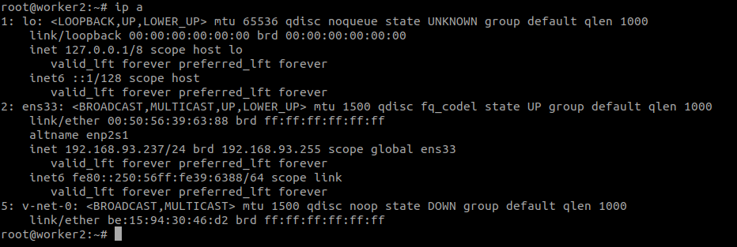
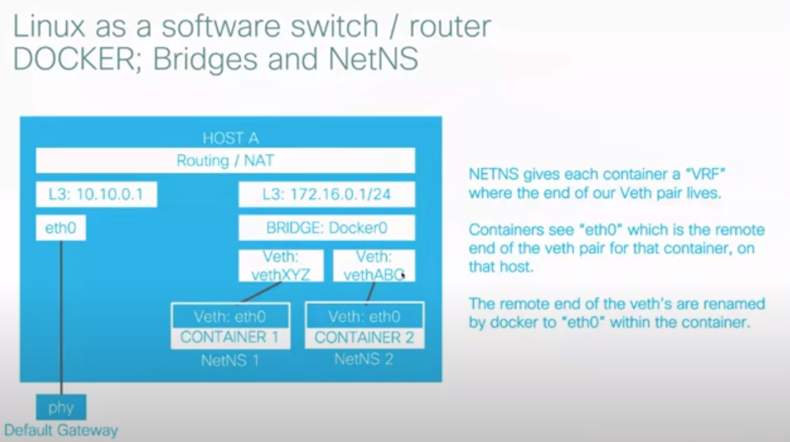
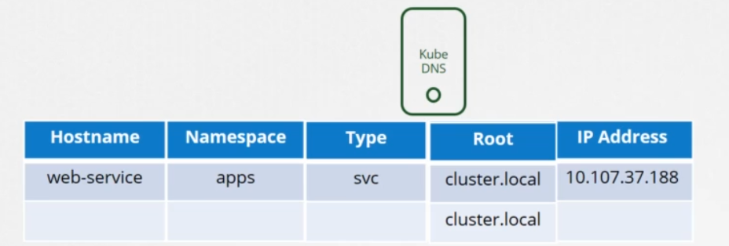
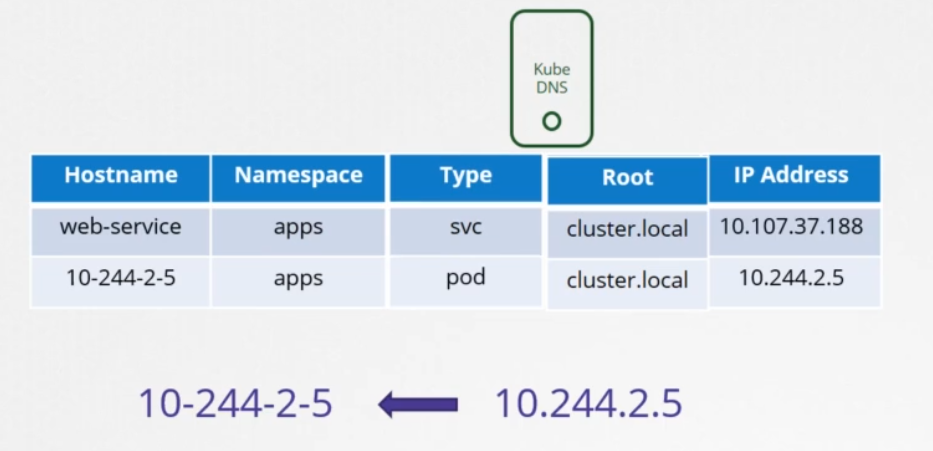

# k8s networking


the first section we are going to talk about: 
- Container Network Building Blocks
- Linux network Namespaces
- Docker networking
- Multi-Host networking
- CNI


# Introducing VETH pairs

The veth devices are virtual Ethernet devices.
veth devices are always created in interconnected pairs.

a pair can be created using the command: 
```
ip link add <p1_name> type veth peer name <p2_name>
```
where, p1_name and p2_name are the names assigned to the two connected end points.


# Network Namespaces
A network namespace is logically another copy of the network stack, with its own routes, firewall rules, and network devices.

```
# create network namespace 
ip netns add red
ip netns add blue


# list network namespaces
ip netns

# list enterface on the host
ip link

# get virtual enterface on the network namespace, both below command are ok.

ip netns exec red ip link 
ip -n red link 

# get arp table on the host and network namespace

arp # get arp table on the host
ip netns exec red arp


# get route table
route
ip netns exec red route
```
untile now we create two network namespaces like this: \



now we want to create virtual Ethernet pair or a virtual cable
```

# these network namespaces faces have no network connectivity, they have no interfaces

# create virtual Ethernet pair or a virtual cable
ip link add veth-red type veth peer name veth-blue
```


The next step is to attach each interface to the appropriate namespaces
```
ip link set veth-red netns red
```


similarly attach the blue interface to blue namespaces
```
ip link set veth-blue netns blue
```


now we can assign IP address to each of these namespaces
```
ip -n red addr add 10.10.15.1 dev veth-red
ip -n blue addr add 10.10.15.2 dev veth-blue
```
now we can bringing up the interface using the IP link
```
ip -n red link set veth-red up
ip -n blue link set veth-blue up
```

now you can ping from red namespace to the blue namespace
```
ip netns exec red ping 10.10.15.2

```

what do you do when you have more of these namespaces? 
How do you enable all of them to communicate with each other?

The answer is easy: just like in the physical world, you create a virtual network inside your host, create a network you need a switch. so in this case you create a virtual network, then you need a virtual switch and connect the namespaces to this virtual switch. \
There are multiple solutions available, such as Linux BRIDGE and Open vSwitch. \
to create a internal bridge network, we add a new interface to the host using ip link
```
ip link add v-net-0 type bridge

```


```
ip link set dev v-net-0 up
```
next step is to connect namespaces to the virtual network switch
```
# before we through further, we have to delete privous link
ip -n red link del veth-red


ip link add veth-red type veth peer name veth-red-br
ip link add veth-blue type veth peer name veth-blue-br

ip link set veth-red netns red
ip link set veth-red-br master v-net-0

ip link set veth-blue netns blue
ip link set veth-blue-br master v-net-0

ip -n red addr add 10.10.15.1 dev veth-red
ip -n blue addr add 10.10.15.2 dev veth-blue

ip -n red link set veth-red up
ip -n blue link set veth-blue up

ip addr add 10.10.15.5/24 dev v-net-0
```
###############################################

**VRF** : \
virtual routing and forwarding(VRF) is a technology that allows multiple instances of a routing table to co-exist whinin the same router at the same time. 



# POD networking
* Every pod should have an IP address.
* Every pod should be able to communicate with every other pod in the same node.
* Every pod should be able to communicate with every other pod on the other nodes without NAT.

**how do you implement a model that solves above requirements?** \
there are many networking solutions available that does this, like flannel, calico, weave-net, cilium, etc.

CNI must manage IP address assignment to PODs

for checking what cni we are using
```
cd /etc/cni/net.d/

```

# Service Networking
when a service is created, it is accessible from all pods on the cluster, irrespective of what nodes the pods are on. \
while a pod is hosted on a node, a service is hosted across the cluster, it is not bound to a specific node. 

unlike pods, services are not created on each nodes or assigned to each node. services are a cluster wide concept. 
they exist across all the nodes in the cluster. when we create a service object on kubernetes, it is assigned an IP address from a predefined range. The kube-proxy gets that IP address and creates forwarding rules on each node in the cluster. 

**How are these rules created?** \
kube-proxy support different ways, such as user-space, iptables and ipvs
it can be configured when we initialized the cluster --proxy-mode [userspace | iptables | ipvs]
by default work with iptables.


**Kube-proxy as as a deamonset**
```
# for check service ip range 
cd /etc/kubernetes/manifests
vim kube-apiserver.yaml
# find --service-cluster-ip-range


# for check the type of kube-prosy(userspace, iptables, ipvs)
kubectl logs -f -n kube-system kube-proxy-86mnp
# "Unknown proxy mode, assuming iptables proxy" proxyMode=""

```

# DNS
* what names are assigned to what objects?
* service DNS records
* POd DNS records


in coredns each service save like this: 



but records for pods are not created by default, but we can enable that explicitly, if enable it, coredns does not use the pod name for adding a records. for each pod kubernetes generate a name by replacing the dots in the ipaddress with dashes.


```
curl http://my-service.default.svc.cluster.local
curl http://10-111-233-196.default.pod

```


before k8s v1.12 the DNS implemented by kubernetes was known as kube-dns. with kubernetes v1.12 the recommended DNS server is CoreDNS. 
```
# coredns config set as a cofigmap to coredns pods
kubectl edit -n kube-system cm coredns
vim /var/lib/kubelet/config.yaml

# where is the cofiguration file located for configuring the coredns service
kubectl describe pod coredns -n kube-system  #  ---> /etc/coredns/Corefile

```