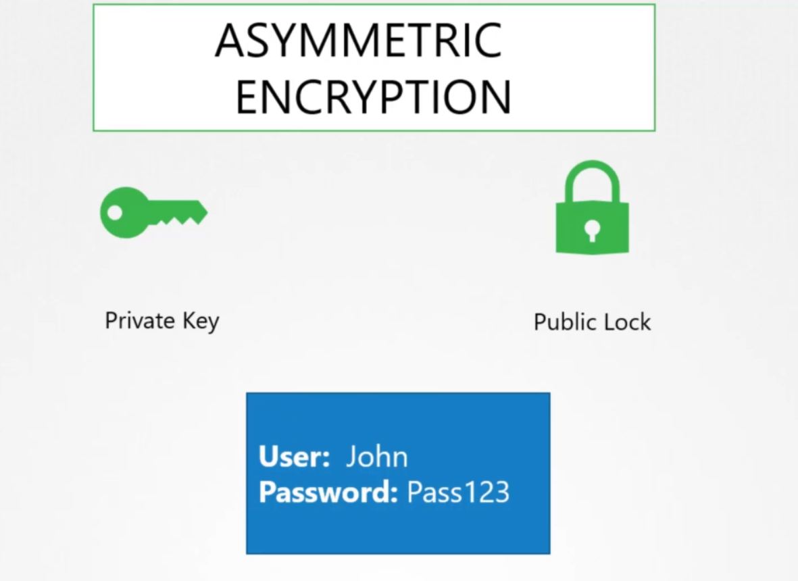
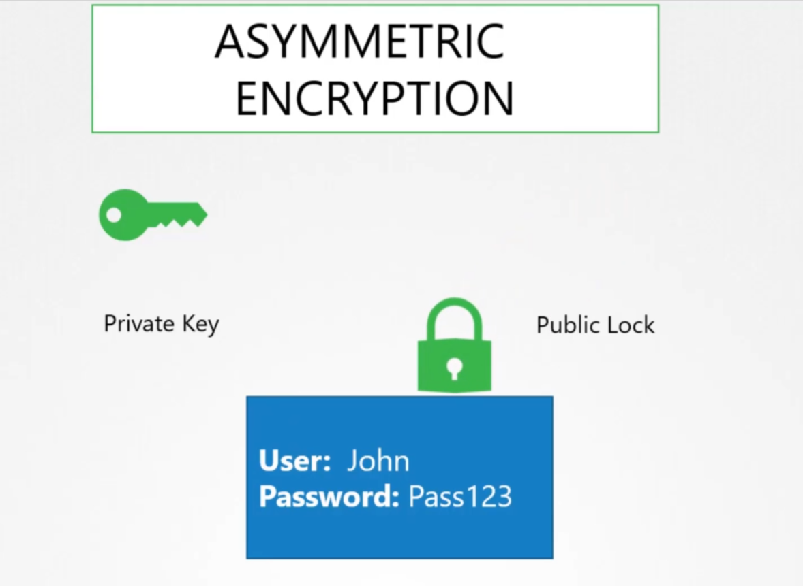
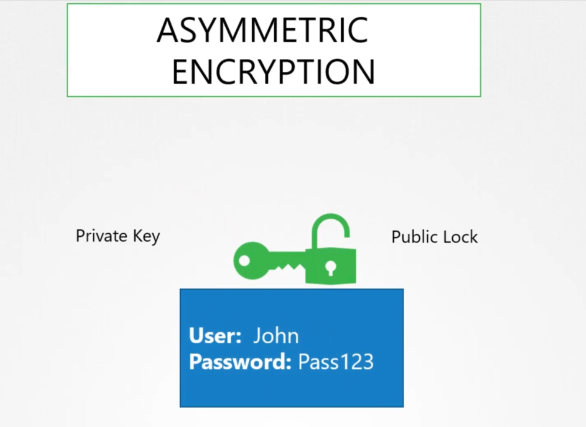
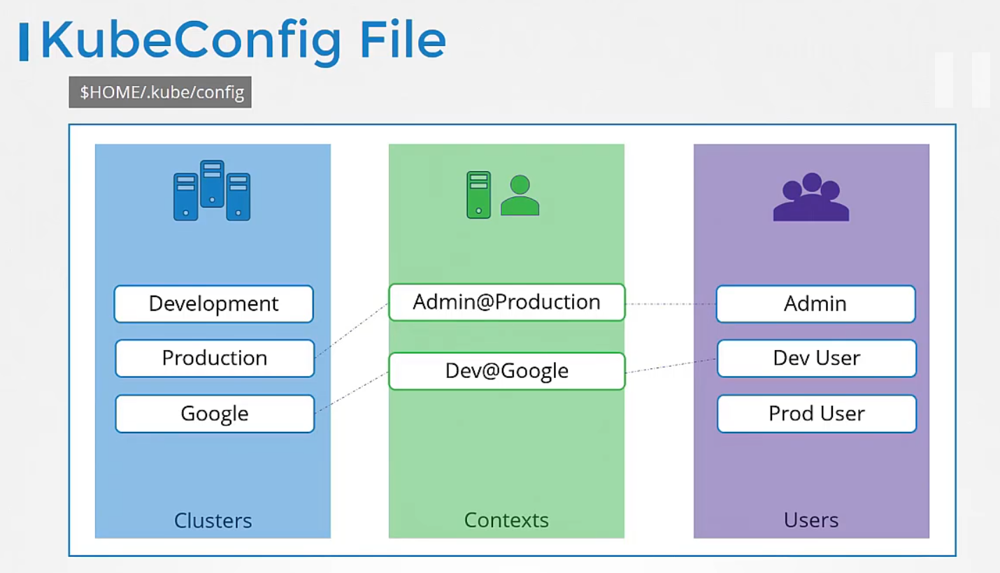
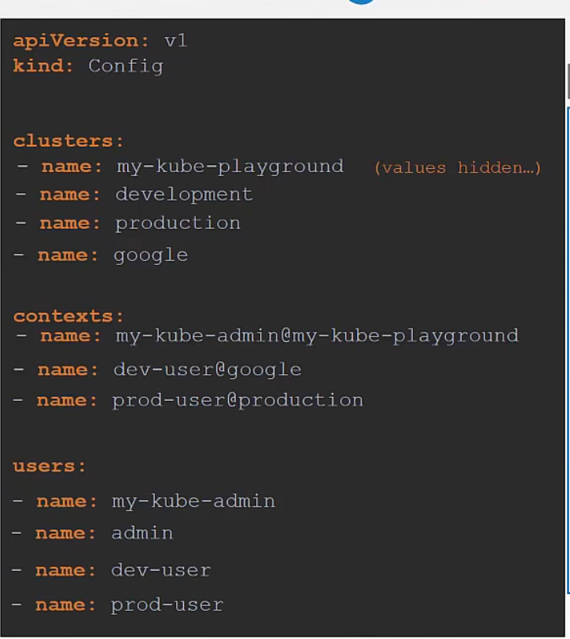
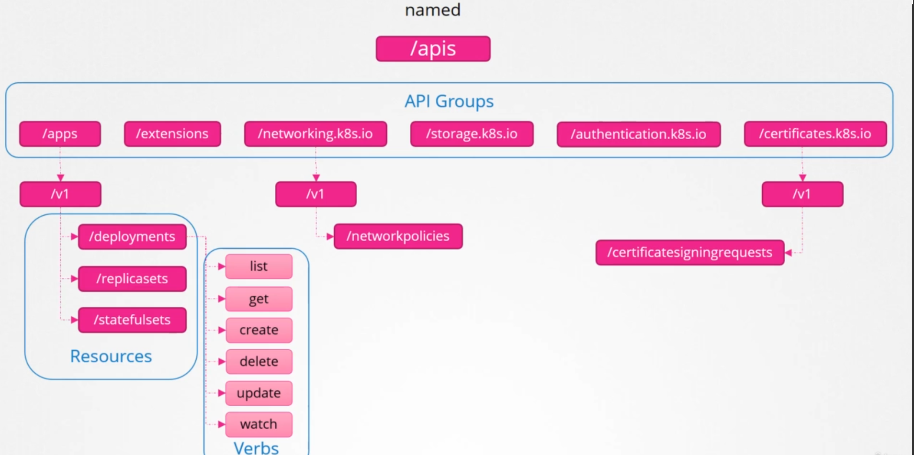

# security related in kubernetes

All communication with the cluster between the various components such as etcd, controller-manager, scheduler, api-server, as well as those running on the worker nodes such as kubelet and kube-proxy is secured using TLS encryption.


another important security issue is that all pods can access all other pods within the cluster, you can restrict access between them using Network Policies.


# SSL/TLS certificate

A certificate is used to guarantee trust between two parties during a transaction. 

### Asymmetric Encryption


A key which is only with me, so it's a private. 
A lock that anyone can access, so it's a public

The trick here if you encrypt or lock that data with your lock, you can only open it with the associated key.


 
## KUBECONFIG


the config file has three sections: **clusters**, **users** and **contexts**
* Cluster are the various kubernetes cluster that you need access to.
* Users are the user accounts with which you have access to these clusters. for example: admin_user, dev_user, ...
* Context marry these together. contexts define which user account will be used to access which cluster.





```
kubectl config view
kubectl config use-context prod-user@cluster.local 


kubectl auth can-i create pods
```


# Api Groups
