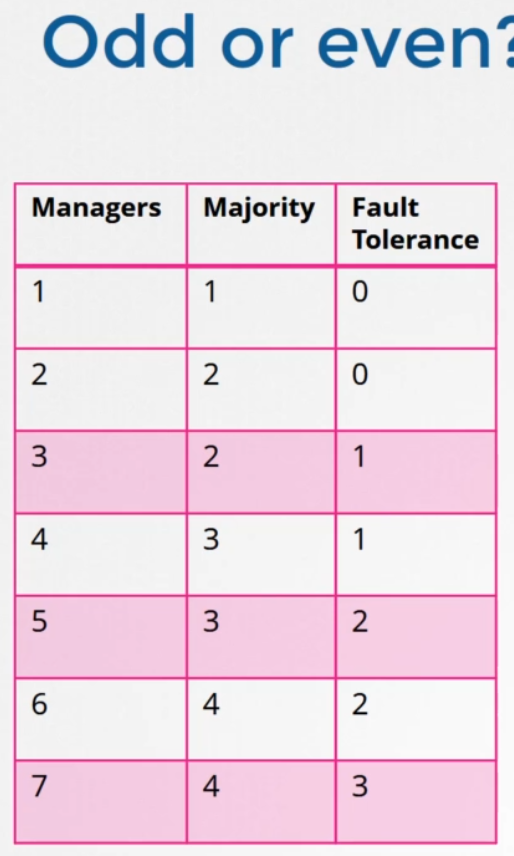

# kubernetes troubleshooting
[refrenece](https://www.youtube.com/watch?v=cRAA1B4R-1U)\
[refrenece](https://www.youtube.com/watch?v=JzGv36Pcq3g&list=PLz0t90fOInA5IyhoT96WhycPV8Km-WICj&index=43)


```

kubeadm --help
kubectl config current-context
kubectl config view
export KUBECONFIG=/etc/kubernetes/admin.conf

kubectl get pod -A 
kubectl get pod --all-namespaces


kubectl edit deploy deployment_name

kubectl describe node node_name

journalctl -flu containerd


host google.com
host ghcr.io
host faradars.org


kubectl get netpol

ls /var/log/containers
ls /var/log/pods
```

----------------------

# ETCD
etcd is a distributed reliable key-value store, this is simple, secure and fast. \
the minimum number of nodes that must be available for the cluster to function properly
Quorum = (N/2) + 1 must be available for the cluster to function properly.


it is recommended to select an odd number as highlighted in the table below

### working with etcd-client 
```
# before you begin, you have to set the following environment variables
export ETCDCTL_API=3
export ETCDCTL_CACERT=/etc/kubernetes/pki/etcd/ca.crt
export ETCDCTL_CERT=/etc/kubernetes/pki/etcd/healthcheck-client.crt
export ETCDCTL_KEY=/etc/kubernetes/pki/etcd/healthcheck-client.key

# and then you can run etcdctl command

apt install etcd-client
etcdctl endpoint status
etcdctl endpoint health

etcdctl alarm list
etcdctl alarm disarm

```


# Part1
```
kubectl get componentstatuses   # get info about the cluster components
kubectl get cs                   # same as above
kubectl -n cilium delete pod --all 
kubectl get events

kubectl config view

journalctl -xe -u kubelet

journalctl -xe -u kubelet --no-pager
```


# using ephemeral container for troubleshooting
```
# allway use distroless base image in pods and use antoher container for troubleshooting.

kubectl run nginx-web --image=nginx
kubectl debug -it nginx-web --image=busybox:1.28 --target=nginx-web
ps aux # you can see the same process namespaces

```